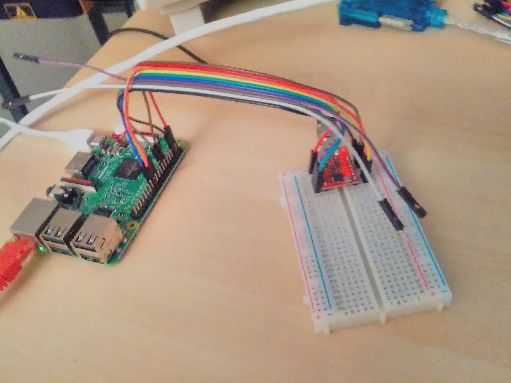

# AmateurRadioDMRRepeater

This is an attempt at making a 70cm DMR repeater which supports VoCoders AMBE+2 and Codec2. It will also support connecting to the Brandmeister DMR network.

Second attempt:

Will be with two Analog devices IC's ADF7021 and a 12.2880Mhz +/- 1ppm TCXO

 ADF7021 module cards from Aliexpress: <a href="https://www.aliexpress.com/item/ADF7021-wireless-data-transmission-module/32817897374.html?spm=2114.search0204.3.1.44135888CtoVgw&ws_ab_test=searchweb0_0,searchweb201602_4_10152_10151_10065_10068_10344_10342_10343_10340_10341_10084_10083_10618_10307_5711211_5722315_10313_10059_10534_100031_10103_10624_10623_10622_10621_10620_10142,searchweb201603_41,ppcSwitch_4_ppcChannel&algo_expid=68150467-45af-43df-84a8-e516cb64444d-0&algo_pvid=68150467-45af-43df-84a8-e516cb64444d&priceBeautifyAB=0"> Aliexpress link</a>

First attempt:

The first version is an experiment model with Silicon lab Si4463 for RX and TX.
The modules with Analog devices ADF7021 is connected to a Raspberry Pi 3.

Si4463 Module: <a href="https://www.aliexpress.com/item/433MHz-SI4463-Wireless-Transmission-Module-100mW-Wireless-Module-Remote-Super-Si4432-Class-CC1101-NRF905-SX1212-E10/32761628244.html?spm=2114.search0104.3.1.x1L0gH&ws_ab_test=searchweb0_0,searchweb201602_1_5130011_10152_10065_10151_10344_10068_10345_10342_10343_51102_10340_10341_10609_5000011_10541_10084_10083_10307_10610_5080011_10312_10059_10313_10314_10534_100031_10604_10603_10103_10605_10594_5060011_10142_10107,searchweb201603_25,ppcSwitch_7&algo_expid=f53bad38-8d45-4344-8498-fb71b55a9b7f-0&algo_pvid=f53bad38-8d45-4344-8498-fb71b55a9b7f&rmStoreLevelAB=0">Aliexpress...</a>

<h2>Progress</h2>

<h3>09.02.2018: Important update!</h3> 

Si4463 is not suited for DMR since it does not have the possiblity to make an RRC-filter on Tx. I also need to use a PLL refrence wich has at +/- 1ppm stability!

 I found out which RF IC I need, its the ADF7021 from analog devices and also a 12.2880Mhz +/- 1ppm TCXO from Golledge in the UK

<h3>9. December 2017: </h3> 

Started writing some more code just for using one module to test the code a bit.

Did hookup one module to Raspberry Pi 3:

<h3>18. December 2017: </h3> 

Managed to get SPI communication up and running with one Si4463 RF IC.

<table>
  <caption>Hookup with one radio module to Raspberry Pi 3</caption>
  <tr>
    <th>Si4463 module</th>
    <th>Raspberry Pi 3</th>
  </tr>
  <tr>
    <td>1, GND</td>
    <td>6, GND</td>

  </tr>
  <tr>
   <td>2, SDN</td>
   <td>18, GPIO24</td>
  </tr>
   <tr>
    <td>5, nSEL</td>
    <td>16, GPIO23</td>

  </tr>
  <tr>
   <td>6, MOSI</td>
   <td>19, MOSI</td>
  </tr> 
  
  <tr>
    <td>7, MISO</td>
    <td>21, MISO</td>

  </tr>
  <tr>
   <td>8, SCK</td>
   <td>23, SCK</td>
  </tr>
   <tr>
    <td>9, IRQ</td>
    <td>13, GPIO27</td>

  </tr>
  <tr>
    <td>12, VCC => +3,3VDC</td>
   <td>1, +3,3VDC</td>
  </tr> 
</table>

73&88 de LA7LKA
